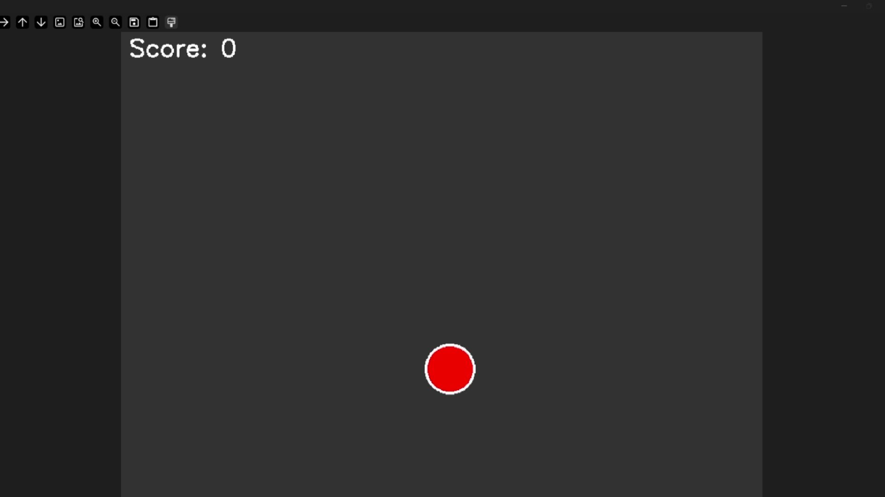

# PIDaim

> [!WARNING]
> the program need run in the main monitor, or it may have problem

use PID to aim  

## environment
in msys64/ucrt64  

```
# MinGW toolchain (g++, gdb, make, etc.)
pacman -S --needed base-devel mingw-w64-ucrt-x86_64-toolchain

# CMake and Ninja (optional)
pacman -S mingw-w64-ucrt-x86_64-cmake mingw-w64-ucrt-x86_64-ninja

# OpenCV (pre‑built for MinGW)
pacman -S mingw-w64-ucrt-x86_64-opencv
the program need run in the main monitor, or it may have problem
```

## compile and run
```
cmake .. -G "MinGW Makefiles" -DCMAKE_BUILD_TYPE=Release -DOpenCV_DIR="C:/msys64/ucrt64/lib/cmake/opencv4"
# or your own path to cmake
```

use "mingw32-make" in .\build\ to build executable file
```
cd to\your\path
cd .\build\
mingw32-make
```
recommend **p: 22.5 i: 15 d: 0.0005** for the base game test.
after complie the file, 2 files named "Base" and "AutoAim" will be  created
Run "Base" first and then the "AutoAim"

## demo

following is a demo of the program (the cursor may be laggy to see)
or you can goto "/sample/demo.mp4" to see.
<p align="center">
    <picture>
      <source srcset="sample/demo.gif" />
      
  </picture>
</p>


## customize 
1) you can change the windows captured
2) fix the mousePos.x & mousePos.y as center for persanal used
3) try adjust the PID 